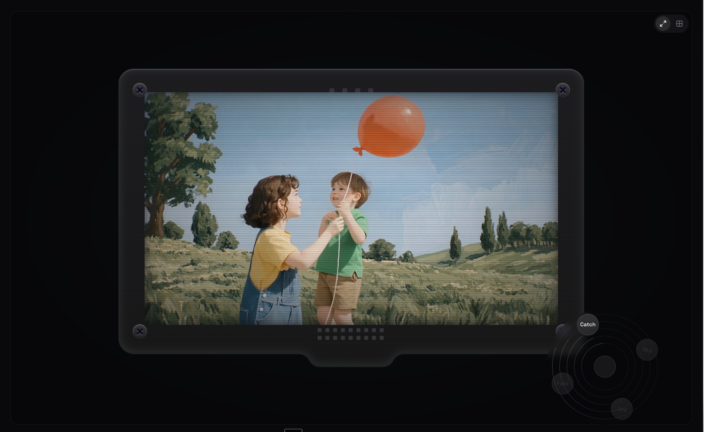
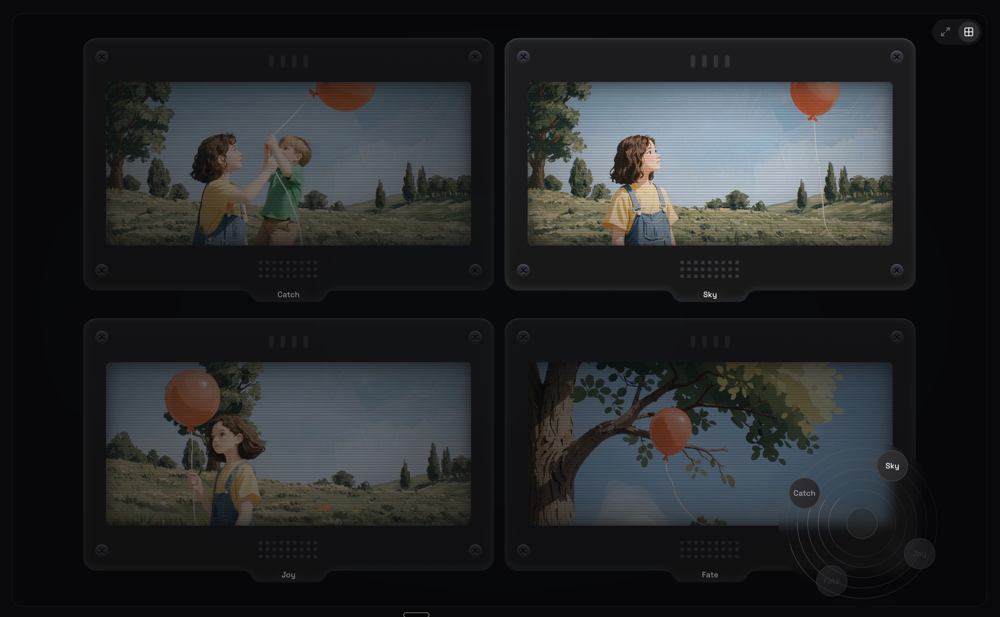

<div align="center">
  <h1>Parallel Worlds</h1>
  
  **Exploring AI video generation and the paradigm shift in media creation**
  
  Experience how AI-generated video transforms storytelling by enabling multiple narrative perspectives, parallel timelines, and interactive exploration of the same story from different angles.
  
  [](https://opensource.org/licenses/MIT)
  
</div>

---

## 🎬 What It Does

<div align="center">
  
  <p><em>Explore a single narrative perspective with interactive navigation</em></p>
</div>

- **🌍 Parallel Narratives** - Experience the same story from multiple perspectives and outcomes
- **🎨 AI-Generated Video** - Leverage AI video generation to create branching narratives
- **🔄 Interactive Exploration** - Navigate between different "worlds" and timelines seamlessly
- **📐 Multi-View Experience** - Compare parallel narratives side-by-side in a grid layout
- **🎯 Narrative Control** - Switch between perspectives like "Catch", "Sky", "Joy", and "Fate"
- **⚡ Real-time Generation** - Watch AI create video variations in real-time

## 📸 Multi-View Preview

<div align="center">
  
  <p><em>Compare parallel narratives simultaneously in a multi-panel view</em></p>
</div>

This app demonstrates how AI video generation fundamentally changes our relationship with media:

- **From Linear to Parallel** - Traditional media follows a single narrative path. AI enables exploring multiple outcomes simultaneously.
- **From Passive to Interactive** - Viewers become explorers, choosing which narrative path to follow.
- **From Fixed to Fluid** - Stories become dynamic, with infinite variations generated on-demand.
- **From Creation to Curation** - The role shifts from creating one perfect story to curating meaningful narrative experiences.

---

## 🚀 Setup

### 1️⃣ Install

```bash
git clone https://github.com/yourusername/parallel-worlds.git
cd parallel-worlds
pnpm install
```


### 2️⃣ Run

```bash
pnpm dev
```

Visit [http://localhost:3000](http://localhost:3000)

The app includes pre-generated video examples. No cloud setup required. ✨

---

## 🔄 How It Works


1. **🌐 World Creation** - Each "world" represents a different narrative perspective or outcome
2. **🔄 Navigation** - Interactive controls let you switch between parallel narratives
3. **📊 Multi-View** - Compare multiple narratives side-by-side in grid layout
4. **⏱️ Timeline Sync** - Navigate through time across different narrative branches
5. **🎨 Visual Exploration** - Experience how the same story evolves differently in each world

---

## 🎯 The Paradigm Shift

This project explores how AI video generation enables:

- **Non-linear Storytelling** - Stories that branch and converge, creating unique experiences for each viewer
- **Infinite Variations** - The same narrative seed can generate countless parallel realities
- **Interactive Media** - Viewers actively shape their experience by choosing which paths to explore
- **Collaborative Creation** - AI and human creators work together to build narrative experiences
- **Personalized Narratives** - Each exploration creates a unique story tailored to the viewer's choices

---

## 📄 License

MIT - Free for personal and commercial use

---

